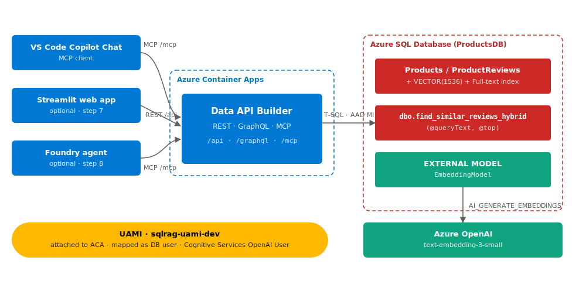

# Chat with your data — Azure SQL + Hybrid Search + DAB + (optional) Foundry agent

> A guided, step-by-step tutorial. You deploy each piece as you learn it.

This repository teaches you how to build an "intelligent search over your
own data" stack on Azure, **end-to-end**, using only managed identity
(no keys, no passwords). Every step has its own folder, its own README,
and (where applicable) its own Bicep + deploy script. You run them in
order.

The same **User-Assigned Managed Identity** is used for every
service-to-service call across the entire tutorial.

---

## What you will build



Full walkthrough of this picture (and four more) lives in [docs/architecture/](docs/architecture/README.md).

---

## The eight steps

Each link below is the start of a self-contained lesson. Do them in
order. Optional steps are marked.

| # | Step | What you do | Folder |
|---|------|-------------|--------|
| 1 | **Foundation** | Resource group, UAMI, Azure SQL DB, Foundry account/project, embedding model deployment, role assignments. Optionally seed sample data. | [steps/01-foundation/step1.md](steps/01-foundation/step1.md) |
| 2 | **Embeddings in SQL** | Database-scoped credential (MI), `get_embedding` SP, backfill `ReviewEmbedding`, optional auto-embed trigger. **BYO appendix.** | [steps/02-embeddings-in-sql](steps/02-embeddings-in-sql/step2.md) |
| 3 | **Hybrid search SP** | Full-text catalog + index, `find_similar_reviews_hybrid` (vector + keyword, RRF). Required follow-on swaps the embedding call for `CREATE EXTERNAL MODEL` + `AI_GENERATE_EMBEDDINGS` so the SP signature drops to `(queryText, top)`. | [steps/03-hybrid-search-sp](steps/03-hybrid-search-sp/step3.md) |
| 4 | **Run DAB locally** | Install DAB CLI, write `dab-config.json`, expose tables + the SP, hit it via REST, GraphQL, and MCP from your laptop. **BYO appendix.** | [steps/04-dab-local](steps/04-dab-local/step4.md) |
| 5 | **Host DAB in ACA** | ACR + AcrPull, build & push image, ACA env + ACA app for DAB, UAMI attached. **BYO appendix.** | [steps/05-dab-on-aca](steps/05-dab-on-aca/step5.md) |
| 6 | **Call hosted DAB** | Wire the hosted `/mcp` endpoint into VS Code GitHub Copilot Chat (agent mode) and drive your SQL data through natural-language prompts. | [steps/06-calling-hosted-dab](steps/06-calling-hosted-dab/step6.md) |
| 7 | *(optional)* **Web UI** | A Streamlit page that calls DAB REST so you can demo it visually. | [steps/07-optional-webapp](steps/07-optional-webapp/README.md) |
| 8 | *(optional)* **Foundry agent** | Portal-only: deploy a chat model, create an agent, add a Custom MCP Tool that points at your hosted DAB. | [steps/08-optional-foundry-agent](steps/08-optional-foundry-agent/README.md) |

---

## Prerequisites (one-time setup — do this before step 1)

Complete this whole section **before** opening step 1. Each tool has a
"why we need it", "install" commands for Windows/macOS/Linux, and a
"verify" command. If a verify command prints a version, you're done
with that tool.

> **Heads up — PowerShell.** All `deploy.ps1` scripts in this tutorial
> are written for **PowerShell 7+** (`pwsh`), not Windows PowerShell 5.1.
> Install pwsh first, then use it for the rest of the tutorial.

### A. Azure subscription + permissions

You need an Azure subscription where you can create resource groups
containing Azure SQL, Azure AI Foundry, Azure Container Registry, and
Azure Container Apps.

- **Owner** or **Contributor + User Access Administrator** at the
  subscription (or at least the resource group) is required, because
  step 1 creates a role assignment (`Cognitive Services OpenAI User` for
  the UAMI on the Foundry account).
- Quota for a small **`text-embedding-3-small`** deployment (~10K TPM)
  in the region you'll use. Default region is `eastus2`.

If you don't know whether you have these, you'll find out fast in
step 1 — the deploy script fails with a specific message and the
step's troubleshooting table maps each error to a fix.

### B. PowerShell 7+ (`pwsh`)

**Why:** every `deploy.ps1` in this tutorial uses pwsh-only syntax and
modern pipeline behavior. Windows PowerShell 5.1 will not work.

**Install:**

```powershell
# Windows
winget install --id Microsoft.PowerShell --source winget

# macOS
brew install --cask powershell

# Linux (Ubuntu/Debian)
# https://learn.microsoft.com/powershell/scripting/install/install-ubuntu
```

**Verify** (in a *new* terminal):

```powershell
pwsh --version    # expect 7.4 or newer
```

From here on, run every command in **`pwsh`**.

### C. Azure CLI (`az`) ≥ 2.60

**Why:** deploys Bicep, creates the resource group, runs the few `az`
commands the tutorial needs.

**Install:**

```powershell
# Windows
winget install --id Microsoft.AzureCLI

# macOS
brew install azure-cli

# Linux
# https://learn.microsoft.com/cli/azure/install-azure-cli-linux
```

**Verify:**

```powershell
az --version       # expect 2.60.0 or newer
```

**Log in and set your subscription:**

```powershell
az login                                              # opens a browser
az account list -o table                              # find the right one
az account set --subscription "<name or GUID>"
az account show -o table                              # confirm
```

### D. Bicep CLI

**Why:** every step deploys Bicep (`az deployment group create`).

**Install:** `az` will install Bicep on first use, but doing it now
gives you a clear error if something is off.

```powershell
az bicep install
az bicep upgrade
```

**Verify:**

```powershell
az bicep version   # expect 0.30 or newer
```

### E. `sqlcmd` (the modern **`go-sqlcmd`**)

**Why:** step 1's deploy script uses `sqlcmd -G` to run the schema and
seed `.sql` files against Azure SQL with your **Entra** identity.
The legacy `sqlcmd.exe` shipped with old SQL Server tooling does not
support `-G`; you need the new Go-based one.

**Install:**

```powershell
# Windows
winget install --id Microsoft.Sqlcmd

# macOS
brew install sqlcmd

# Linux
# https://github.com/microsoft/go-sqlcmd/releases
```

**Verify:** in a *new* terminal so the PATH refreshes:

```powershell
sqlcmd --version          # prints a version line in either go-sqlcmd or legacy sqlcmd
```

You want to see something like `sqlcmd: v1.8.x` (go-sqlcmd) or
`Version 17.x` (legacy ODBC sqlcmd). Both support the `-G` flag for
Entra auth, which is what the deploy scripts use.

> If `sqlcmd --version` is not recognized, open a brand-new terminal —
> `winget` updates `PATH` for new shells only.

### F. `.NET 8` SDK + the **DAB CLI**  *(needed from step 4 onward)*

**Why:** step 4 runs Data API Builder locally; step 5 builds it into a
container. The DAB CLI is a .NET global tool.

**Install .NET 8:**

```powershell
# Windows
winget install --id Microsoft.DotNet.SDK.8

# macOS
brew install --cask dotnet-sdk

# Linux
# https://learn.microsoft.com/dotnet/core/install/linux
```

**Install the DAB CLI:**

```powershell
dotnet tool install --global Microsoft.DataApiBuilder
```

**Verify:** open a *new* terminal so the dotnet-tools PATH is picked up:

```powershell
dotnet --version          # expect 8.x or higher
dab --version             # expect 1.x or 2.x
```

### G. Python 3.11+  *(only if you'll do the optional steps 7 or 8)*

**Why:** the optional Streamlit web UI in step 7 and any local Python
clients in step 6 use Python 3.11 or newer.

**Install:**

```powershell
# Windows
winget install --id Python.Python.3.12

# macOS
brew install python@3.12

# Linux
sudo apt-get install -y python3.12 python3.12-venv
```

**Verify:**

```powershell
python --version          # expect 3.11.x or newer
```

### H. *(Not required)* Docker Desktop

You do **not** need a local Docker daemon. Step 5 uses
`az acr build` (cloud build) to build the DAB image inside Azure
Container Registry.

### I. Optional but recommended VS Code extensions

If you use VS Code, these make the tutorial smoother (none of them are
required for the deploys to succeed):

- **Azure Account / Azure Resources** — browse resources you create
- **Bicep** — syntax + IntelliSense for the `.bicep` files
- **SQL Server (mssql)** — query Azure SQL from inside VS Code
- **Draw.io Integration** (`hediet.vscode-drawio`) — open the `.drawio`
  files in `docs/architecture/`

### Final sanity check

In a new pwsh window:

```powershell
pwsh --version                          # 7.4+
az --version | Select-String "azure-cli"# 2.60+
az bicep version                        # 0.30+
sqlcmd --version                        # any (go-sqlcmd or legacy)
dotnet --version                        # 8.x  (if you'll do step 4+)
dab --version                           # any  (if you'll do step 4+)
az account show --query name -o tsv     # your subscription name
```

If all of those succeed, you are ready for **step 1**.

---

## Naming and parameters

Everything is parameterized on **two strings**:

- `-NamePrefix` — 3–12 lowercase alphanumeric chars (e.g. `sqlrag`)
- `-EnvironmentName` — 2–6 chars (default `dev`)

Resource names are derived from those two values plus a 6-char hash of
your subscription + resource group, so globally-unique names (SQL
server, ACR, Foundry account) stay stable per environment.

You also pick:

- `-ResourceGroupName` — the RG to put everything in
- `-Location` — Azure region (default `eastus2`)

If your environment has a policy that blocks the default model, region,
or SKU, the deploy will fail with a specific message and the step's
troubleshooting table will tell you exactly which parameter to change.

---

## Cost

All resources use the cheapest viable SKU for a learning environment:

- Azure SQL serverless `GP_S_Gen5_2` with auto-pause (60 min idle)
- Azure AI Foundry — **per-token billing only**
- ACR Basic
- Container Apps with `minReplicas = 0` (scale to zero)

Idle cost across the whole tutorial is **a few cents per day** (mostly
SQL storage). Active embedding/inference cost is whatever tokens you
push through `text-embedding-3-small` and (in optional step 8) your
chat model.

When you're done: `.\scripts\teardown.ps1 -ResourceGroupName <rg> -AutoApprove`
deletes everything in one call.

---

## Bring your own data

You can use this tutorial in three ways:

1. **As-is with the sample data.** Step 1's deploy script seeds 10
   products and 18 reviews about office equipment. Embed those, search
   them, ship a demo.
2. **Skip the sample data.** Pass `-SeedSampleData:$false` to step 1's
   deploy script. Use the **BYO appendix in step 2** to point everything
   at your own table.
3. **Both.** Let the sample data deploy, then add your own table later.
   Step 2's BYO appendix walks through making a parallel
   `find_similar_<your_table>_hybrid` SP. Doing both is supported and
   doesn't conflict.

You can switch from option 1 to option 3 any time — there's no point of
no return.

---

## Repo layout

```
README.md                          ← you are here
docs/
  CHANGELOG.md
  architecture/                    ← editable .drawio diagrams
scripts/
  teardown.ps1                     ← deletes the whole RG
steps/
  01-foundation/
    README.md
    deploy.ps1
    bicep/main.bicep
    sql/00-create-schema.sql
    sql/01-seed-products.sql
    sql/02-seed-reviews.sql
  02-embeddings-in-sql/            ← built next
  03-hybrid-search-sp/
  04-dab-local/
  05-dab-on-aca/
  06-calling-hosted-dab/
  07-optional-webapp/
  08-optional-foundry-agent/
```

Each step's `deploy.ps1` writes an `outputs.json` next to itself with
the values later steps need. So step 5 reads step 1's `outputs.json` to
find the SQL FQDN and the UAMI resource ID — you don't have to copy
anything by hand.

---

## Start here

[Step 1 — Foundation](steps/01-foundation/step1.md)
