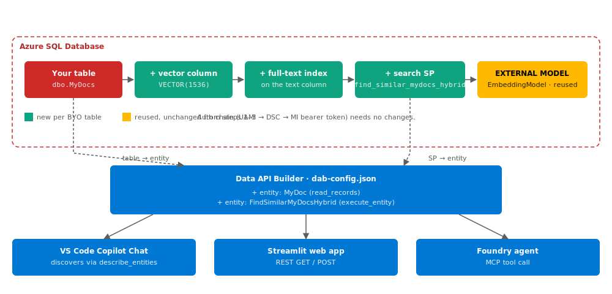

# BYO appendix — expose your own table or SP through DAB

After the [step 2 BYO appendix](../../02-embeddings-in-sql/byo/README.md)
gave your table embeddings and the [step 3 BYO appendix](../../03-hybrid-search-sp/byo/README.md)
gave you a search SP, this appendix wires both into DAB so they show up
as REST + GraphQL + MCP endpoints.



This appendix is the **bottom half** of that diagram — the DAB box and
the client row.

You can edit `dab-config.json` directly, or use `dab add`. Both end up
in the same place.

---

## Option 1 — Edit `dab-config.json`

Add a new entity under `entities`:

```jsonc
"MyDoc": {
  "source": { "object": "dbo.MyDocs", "type": "table" },
  "permissions": [
    { "role": "anonymous", "actions": ["read"] }
  ],
  "description": "Your documents table."
},
"FindSimilarMyDocsHybrid": {
  "source": {
    "object": "dbo.find_similar_mydocs_hybrid",
    "type": "stored-procedure"
  },
  "rest":    { "methods": ["POST"] },
  "graphql": { "operation": "mutation" },
  "permissions": [
    { "role": "anonymous", "actions": ["execute"] }
  ],
  "description": "Hybrid search over MyDocs."
}
```

Then restart `dab start`.

---

## Option 2 — `dab add` (CLI)

```powershell
cd .\steps\04-dab-local

dab add MyDoc `
  --source dbo.MyDocs `
  --permissions "anonymous:read" `
  --description "Your documents table."

dab add FindSimilarMyDocsHybrid `
  --source dbo.find_similar_mydocs_hybrid `
  --source.type stored-procedure `
  --rest.methods POST `
  --graphql.operation mutation `
  --permissions "anonymous:execute" `
  --description "Hybrid search over MyDocs."
```

---

## Try it

```powershell
# REST
curl -X POST http://localhost:5000/api/FindSimilarMyDocsHybrid `
  -H "Content-Type: application/json" `
  -d '{ "queryText": "your query", "top": 5 }'
```

The MCP `tools/list` endpoint at `http://localhost:5000/mcp` will now
include `MyDoc` (DML) and the SP-backed tool too.

---

## Going to production

When you re-deploy DAB to ACA in step 5, the same `dab-config.json` is
baked into the container image. As long as your BYO entities are listed
here, they ride along automatically.
